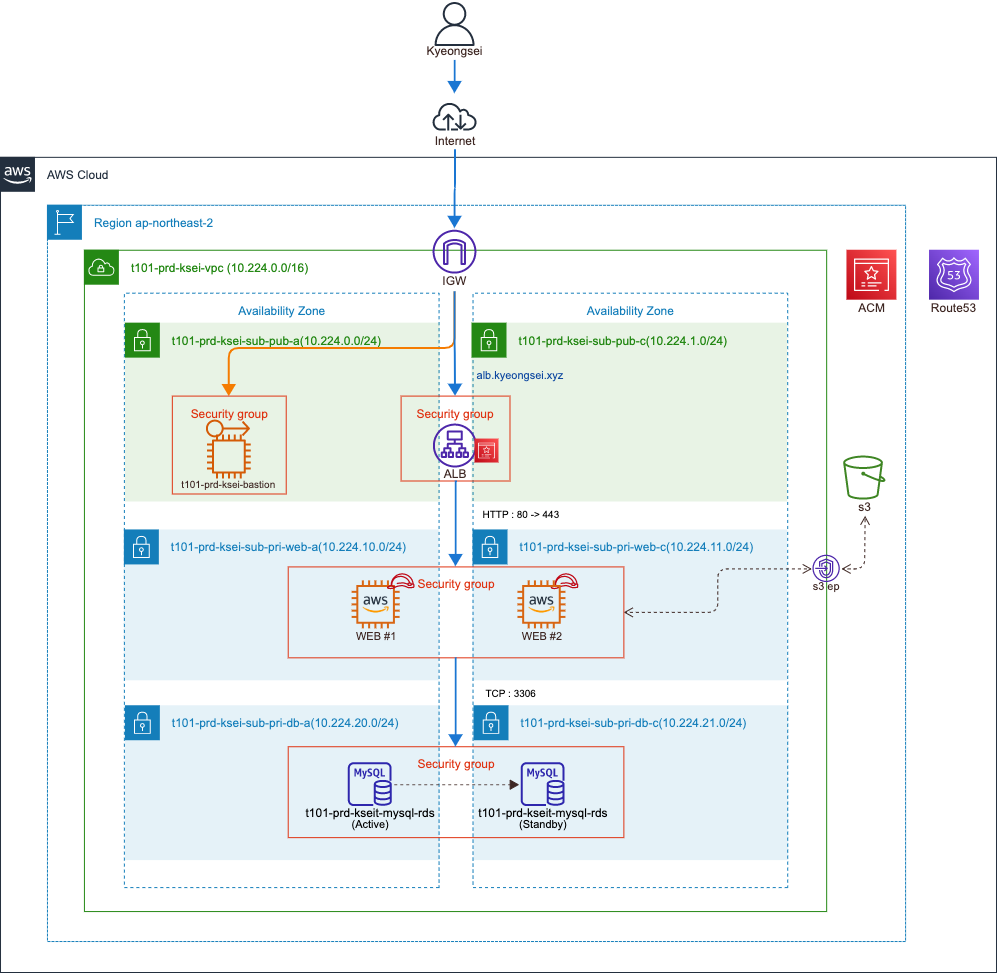
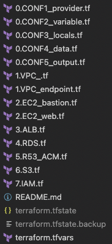
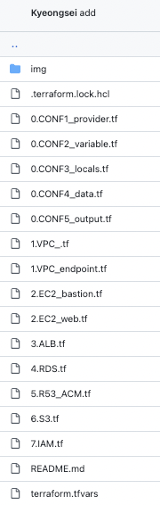

# Terraform 을 이용한 AWS 2Tier 구축


## Architecture



<aside>
💡 CloudNet@ Gasida님과 함께하는 Terraform 101 Study(=T101)에 참여하고 있으며, 벌써 참여한지 4주차가 지나가고있다.

사실 테라폼을 알게 된지 어연.. 2년이 되가지만, 시간에 비해 전혀 친하지 않은 우리 사이.. 쉽지않은 녀석이다. 사실상 처음 접한건 CCCR 교육 때 였지만(사실 기억에 남은게 하나 없음), 그래도 회사 입사하고 수습끝나고 첫 고객사부터 테라폼을 이용하여 계속 구축을 진행하기는 하였으나, 어디가서 내 기술스택에 테라폼을 적어두어도 되나 싶은 생각이 많이 들었던 나날들 이였다.

항상 혼자 맡은 고객사에 대하여 ‘AWS 인프라 구축’만을 위한 테라폼이였다. 다른팀원들과 테라폼으로 협업을 해본적도 없고, 간단한 뼈대만 테라폼으로 배포하고 그뒤는 AWS 콘솔에서 손수 뚝딱뚝딱 한적도 많아서 사실상 테라폼을 테라폼 답게 써본적이 없었던것같다. 그래서 이번 스터디를 통하여 처음 부터 돌아가서 테라폼을 테라폼답게 써보기위하여 다시 처음 부터 돌아가서 하나씩 정리해나가려고한다.

가장 많이 해보았으나, 생각해보면 제대로 해본적없는,
2Tier 인프라 처음부터 끝까지 테라폼으로만 뚝딱하기 !
(다른 고수 분들은 짱짱한 글 쓰는데 상대적 박탈감 … :sad…)

</aside>

## 전제 조건

1. AWS 계정
2. PC에 Terraform 설치
    1. M1
3. Route53에 네임서버까지 등록된 상태
    1. 도메인은 hosting.kr에서 구입 후 Route53 NS등록
4. Pemkey는 미리 AWS 콘솔에서 생성후 다운 받은 상태
    1. Basiton 용, WEB서버용 

---

의식의 흐름대로 모두다 까지는 아니고 부분부분만 작성할예정(?)이오니 미리 사과의 말씀올립니다.

        

대다수가 [main.tf](http://main.tf) [outputs.tf](http://outputs.tf) [providers.tf](http://providers.tf) [variables.tf](http://variables.tf) 등 국룰로 분류하지만, 혼자 편하게 하려던 버릇일 수 도 있으나, AWS 서비스 기준(?)으로 편하게 파일을 분류해 놓았다…(본인취향가득)

들어가기에 앞서,

우리의 정보는 소중하니.. 꼭 깃헙에올리실땐 AWS Credential , PW등,, 소중한 정보는 올리지않게 gitignore 필수이십니다

## .gitignore

```jsx
*.tfstate
*.tfstate.backup
*.tfstate.lock.info
*gitignore*.tf
.terraform/
*.log
*.bak
.vagrant/

override.tf
override.tf.json
*_override.tf
*_override.tf.json

.DS_Store
.vscode/
.sentinel
.terraformrc
terraform.rc
```

## 0.CONF1_provider.tf

```jsx
provider "aws" {
  region = var.region
  shared_credentials_file = "~/.aws/credentials"
  profile                 = var.profile

  default_tags {
    tags = {
      T101 = "kyeongsei"
    }
  }  
}
```

추후에 backend부분과 alias로 다른 리전 등록을 위해서 하나 마련한곳

종종 AWS Credenials값을 git에 올려서 해킹당하는 사례가 있으오니 다들 조심하시길.. 🙏

```jsx
$ code ~/.aws/credentials
[profile]
aws_access_key_id = <소중한 개인정보>
aws_secret_access_key = <소중한 개인정보>
```

default tag를 통하여 테라폼으로 생성된 모든 리소스에는 태그가 박힙니다 !

나중에 이 태깅을 통하여 비용확인이라던지, AWS MAP2.0 태깅걸때 유용하게 사용하실 수 있습니다. (꿀팁!)

```jsx
  default_tags {
    tags = {
      T101 = "kyeongsei"
    }
  } 
```

## 0.CONF2_variable.tf 와 terraform.tfvars

전체적인 variable 변수들 선언, 변수들에 대한 값들은 terraform.tfvars에 다 넣어주었기 때문에, 나중에 이코드들 똑같이 복붙하여 QAS,DEV환경 사용시 terraform.tfvars 페이지에서만 수정하면 뚝!딱!

## 0.CONF3_locals.tf

아직도 locals변수를 제대로 모르겟으나, VPC와 Subnet용도로 잘 사용하는 중이오나, 해당 부분도 더 편하게 사용할 수 있는 방법은 계속해서 찾는중…

```jsx
locals {
  vpc_cidr = "10.224.0.0/16"

  public_subnets_vpc = [
    {
      purpose = "pub"
      zone = "${var.region}a" ## Must be put a AZs alphabet
      cidr = "10.224.0.0/24"
    },
    {
      purpose = "pub"
      zone = "${var.region}c" ## Must be put a AZs alphabet
      cidr = "10.224.1.0/24"
    }
  ]
private_subnets_vpc_web = [
    {
      purpose = "pri-web"
      zone = "${var.region}a" ## Must be put a AZs alphabet
      cidr = "10.224.10.0/24"
    },
    {
      purpose = "pri-web"
      zone = "${var.region}c" ## Must be put a AZs alphabet
      cidr = "10.224.11.0/24"
    }
  ]
...
```

## 0.CONF4_data.tf

가장 애정하는 data..! 

주로 쓰는건 AMI가져오거나, 이미 만들어진 리소스들에 대해서 가져오는것 뿐이지만 왠지 모르게 정이가는..

최신 AMI 불러오는 code

```jsx
data "aws_ami" "amz2" {
 most_recent = true
 owners = ["amazon"]
 filter {
   name   = "owner-alias"
   values = ["amazon"]
 }
 filter {
   name   = "name"
   values = ["amzn2-ami-hvm*"]
 }
}
data "aws_ami" "ubuntu1804" {
 most_recent = true
 owners = ["099720109477"] # Canonical

 filter {
   name   = "name"
   values = ["ubuntu/images/hvm-ssd/ubuntu-bionic-18.04-amd64-server*"]
 }
}
```

그러나 처음 구축 말고, 계속 운영을 하신다면 instance 부분에서 lifecycle을 안걸어주면, 최신AMI가 변경될때 해당 instance가 종료되고 다시 런칭되는 끔찍한일이 발생..

```jsx
resource "aws_instance" "web" {
  ami           = data.aws_ami.amz2.id
...
  lifecycle {
    ignore_changes = [ami]
  }
```

(이건 평상시에 많이쓰는, 기존 구축된 VPC,Subnet data로 뽑기.. 뽑아서 저위에 이제 이어서 테라폼으로 인프라 구축하면 얼마나좋게유)

```jsx
data "aws_vpc" "vpc" {
  filter {
    name = "tag:Name"
    values = ["com-a10-dev-vpc"]
  }
}

data "aws_subnet" "subnet-a" {
  filter {
    name = "tag:Name"
    values = ["com-a10-dev-apne-2a-db-private-subnet"]
  }
}

data "aws_subnet" "subnet-c" {
  filter {
    name = "tag:Name"
    values = ["com-a10-dev-apne-2c-db-private-subnet"]
  }
}
```

## 0.EC2_web.tf
해당 부분은 코드가 그냥 무난무난해서 패스..

이전엔 유저데이터부분에 변경이있으면 다시 띄워지는거 lifecycle로 임시방편해두었는데, 이번 스터디를 통하여 해당 변수를 알게 되었다 감격..
```
  # user_data     = data.template_file.web-userdata.rendered
  # user_data_replace_on_change = false
```
이번엔 못올렸으나 나중에 추가될 부분으로는,
+ EBS 여러개 attache 할때 depens_on을 사용해야된다. 안그러면 순서 무시하고 아무렇게나 빨리생성되는대로 붙여졌었다...
+ 이번 코드에는 보안그룹이 몇개 안되지만, 보안그룹 인아웃바운드가 많을때, csv로 관리하는 부분은 추가 할예정 (착모 data/~.csv)

## 3.ALB.tf
이전에는 항상 테라폼으로 ALB로 80리스너까지만 만들고, 그후에는 콘솔에서 ACM 발급받고 했었는데, 이제는 ***5.R53_ACM.tf*** 을 통하여 바로 가능 ! 

ALB Target group에서 세세한 옵션까지 설정
```
resource "aws_lb_target_group" "pub-alb-80" {
  name = format(
      "%s-%s-%s-pub-alb-tg80",
      var.title,var.environments,var.subtitle
    )  
  port     = 80
  protocol = "HTTP"
  vpc_id   = aws_vpc.vpc.id
  
  deregistration_delay = 30
  health_check {
    enabled = true
    healthy_threshold = 3 
    unhealthy_threshold = 3
    interval = 30
    path = "/common/login.do"
    port = "traffic-port"
  }  
}
```

추가해놓을 부분
+ NLB (NLB보안그룹 관련)
+ ASG
+ NLB+ALB

## 4.RDS.tf
RDS는 한번 띄우기 정말 시간이 오래걸린다...
Aurora와 RDS도 코드가 많이다르고, RDS도 엔진마다 옵션이 조금씩 달라서 확인이 조금필요하다..

특히 항상 Parameter group에 대하여 고민이 많았는데, dynamic을 통하여 깔끔히 해결 완료하였다.
DB파라미터값이 많아지니 terraform.tfvars가 좀 길어지는거같아서, 해당부분은 나중에 따로빼서 관리하는게 나을듯하다.

```
resource "aws_db_parameter_group" "paramgrp" {
    name = lower(
        format("%s-%s-%s-%s-paramgrp",
        var.title,var.environments,var.subtitle,var.enginever)
    )
    
    family = var.paramgrp_famliy
    description = format(
      "%s-%s-%s-%s-paramgrp",
      var.title,var.environments,var.subtitle,var.enginever
    )
    
    dynamic "parameter" {
        for_each = var.parameter
        content {
            name = parameter.value["name"]
            value = parameter.value["value"]
        }
    }   
}
```
***terraform.tfvars***
```
parameter = {
    param = {
        name = "time_zone"
        value = "Asia/Seoul"
    },
    param = {
        name = "character_set_client"
        value = "utf8"
    },
    param = {
        name = "character_set_connection"
        value = "utf8"
    },
    param = {
        name = "character_set_filesystem"
        value = "utf8"
    },
    param = {
        name = "character_set_results"
        value = "utf8"
    },
    param = {
        name = "character_set_server"
        value = "utf8"
    },
    param = {
        name = "activate_all_roles_on_login"
        value = "1"
    }    
}
```

또한 RDS는 리소스에 대문자 입력이 안되서, 이전에 Name이나 description에 대문자가 있던거 복붙하면 빨간오류가 뜬다 ㅠ.. 그래서 RDS땐 무조건 lower 소문자로 바꾸는 부분 필수..

+ 파라미터 값에 따라 dynamic, static이 있어 바로 수정하는 옵션 몇개는 넣어야됨 (apply_method=immediate)


## 5.R53_ACM.tf

한번에 배포하는게 아니였다면, Route53도 resoure로 만들면 좋았을텐데,
그러나 ACM DNS인증까지 성공해서 깔끔!

+ ALB생성되면 Route53에 CNAME 추가 해서 도메인까지 매핑되는것

참고 링크
  https://blog.outsider.ne.kr/1398
  https://registry.terraform.io/providers/hashicorp/aws/latest/docs/resources/acm_certificate
  https://scbyun.com/916
  https://registry.terraform.io/providers/hashicorp/aws/latest/docs/resources/acm_certificate_validation


워낙 글재주가 없어서 너무 두서없는 글이지만, 틈틈히 추가해야겠다..